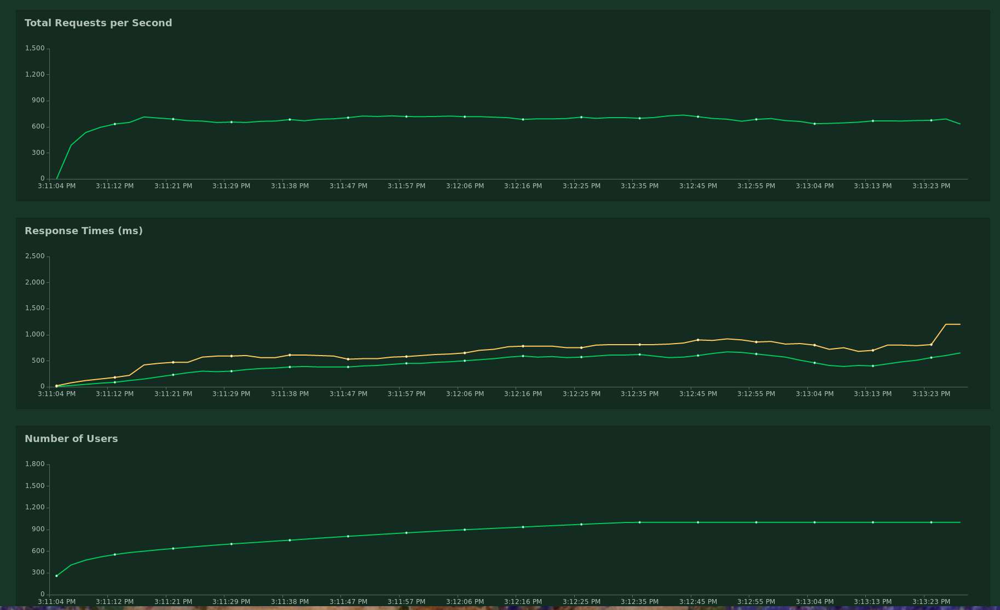
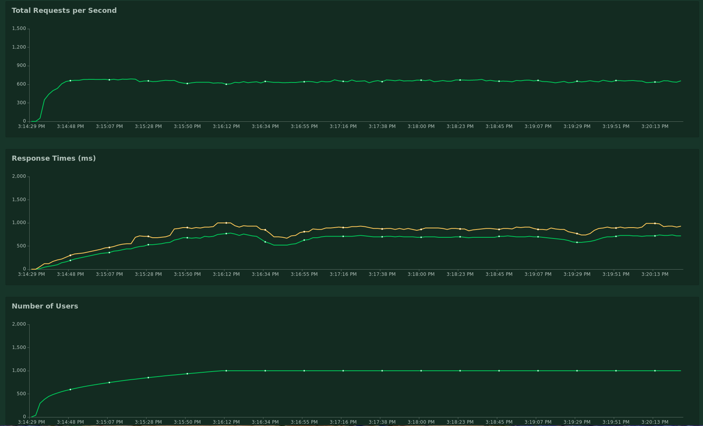

## Locust testing

These are some minimal load / performance testing tools using [locust](https://locust.io/)

This isn't extremely scientific, but requests per second and response times were comparable
with or without robby. Even at 3000 req/sec, the latency was not greatly different with robby
than without. In addition, on my local machine, stock nginx gave up under load before robby did.

Lone Nginx:

Nginx behind Robby:

